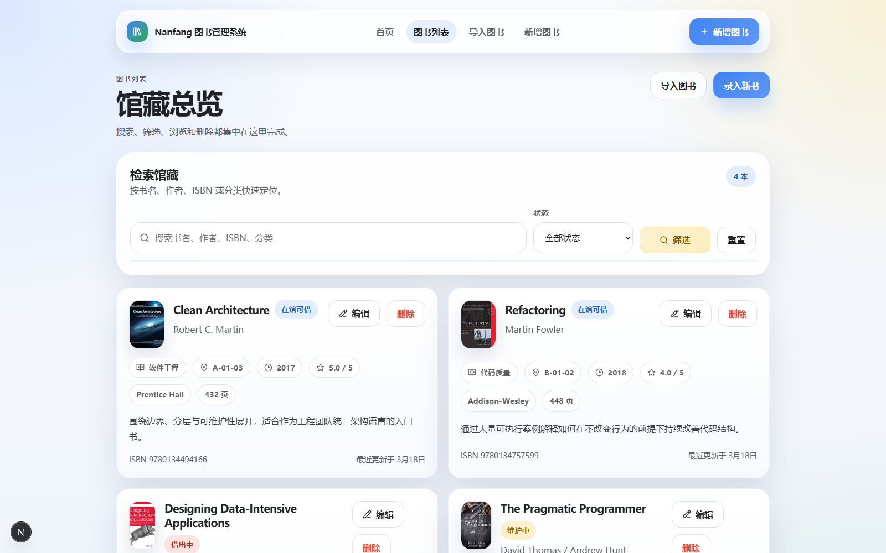

# Nanfang 图书管理系统

> 一个适合作为 `图书管理系统`、`Next.js 后台项目`、`毕业设计`、`毕设`、`课程设计`、`课程作业` 参考的中文开源项目。

[](https://nextjs.org/)
[](https://react.dev/)
[](https://www.sqlite.org/)
[](https://turso.tech/)
[](https://www.mysql.com/)
[](./LICENSE)

这个仓库现在支持三种数据库模式：

- `SQLite`：默认本地开发，开箱即跑
- `Turso`：适合部署到 Vercel 做公开演示
- `MySQL`：适合接入本地 MySQL 或远程自建数据库

快速入口：

- [项目截图](#页面预览)
- [本地启动](#本地启动)
- [环境变量](#环境变量)
- [MySQL 使用说明](./docs/mysql.md)
- [Vercel + Turso 部署说明](./docs/vercel-turso.md)

## 项目简介

这是一个围绕馆藏录入、资料维护、检索筛选和外部书目补全构建的现代化图书管理系统。

它不是那种把所有功能堆在一个页面里的练手 Demo，而是拆成了更清晰的业务页面：

- `/` 欢迎首页
- `/books` 图书列表页
- `/books/import` 外部图书导入页
- `/books/new` 新增图书页
- `/books/[id]/edit` 编辑图书页

如果你想找的是：

- `Next.js 图书管理系统`
- `React 后台管理系统`
- `毕业设计 / 毕设项目`
- `课程设计 / 课程作业`
- `CRUD 管理系统源码`

这个仓库会比普通“表单 + 表格”的示例更完整一些。

## 页面预览

### 首页与导航


### 图书列表与搜索筛选



### 外部导入与补全入口


### 录入流程与业务表单


### 项目动图


## 功能亮点

- 清晰页面结构：首页、列表、导入、新增、编辑各归各位
- 搜索与筛选完善：支持书名、作者、ISBN、分类和状态检索
- 外部书目补全：接入 Open Library 搜索与预填
- 三驱动兼容：SQLite、Turso、MySQL 共用同一套业务逻辑
- 现代界面：明亮配色、卡片布局、移动端可用
- 适合二开：类型、校验、数据访问和页面职责相对清晰

## 技术架构

- `Next.js 16` App Router
- `React 19`
- `TypeScript`
- `Zod` 表单校验
- `SQLite / Turso / MySQL` 数据层适配
- `Open Library API` 外部图书补全
- `Server Actions` 提交与跳转

## 本地启动

### 1. 安装依赖

```bash
npm install
```

### 2. 选择数据库模式

默认使用 SQLite，无需额外配置。

如果你想切到 MySQL，可先参考 [MySQL 使用说明](./docs/mysql.md)，至少配置：

```bash
DATABASE_DRIVER="mysql"
MYSQL_HOST="127.0.0.1"
MYSQL_PORT="3306"
MYSQL_USER="root"
MYSQL_PASSWORD=""
MYSQL_DATABASE="nanfang_library"
MYSQL_SSL="false"
```

注意：

- 当 `DATABASE_DRIVER="mysql"` 时，本地或远程 MySQL 必须处于可连接状态
- 如果 MySQL 没有启动，`npm run dev` 进程本身可能还能起来，但访问首页、图书列表、成员、借阅等依赖数据库的页面时会报 `connect ECONNREFUSED`
- 只想本地快速跑通演示时，建议先改回 `DATABASE_DRIVER="sqlite"`

如果你想切到 Turso，则配置：

```bash
DATABASE_DRIVER="turso"
DATABASE_URL="libsql://your-db-name-your-org.turso.io"
DATABASE_AUTH_TOKEN="..."
```

### 3. 初始化示例数据

```bash
npm run db:seed
```

### 4. 启动开发服务器

```bash
npm run dev
```

默认访问：

```text
http://localhost:3000
```

## 常用命令

```bash
npm run dev
npm run build
npm run start
npm run lint
npm run db:init
npm run db:seed
npm run db:reset
npm run assets:preview
```

## 环境变量

```bash
NEXT_PUBLIC_APP_URL="http://localhost:3000"

DATABASE_DRIVER="sqlite"
DATABASE_URL=""
DATABASE_AUTH_TOKEN=""

MYSQL_HOST="127.0.0.1"
MYSQL_PORT="3306"
MYSQL_USER="root"
MYSQL_PASSWORD=""
MYSQL_DATABASE="nanfang_library"
MYSQL_SSL="false"

OPEN_LIBRARY_APP_NAME="nanfang-library-management-system"
OPEN_LIBRARY_CONTACT_EMAIL=""
```

说明：

- `DATABASE_DRIVER` 支持 `sqlite`、`turso`、`mysql`
- `DATABASE_URL` 与 `DATABASE_AUTH_TOKEN` 只在 `turso` 模式下使用
- `MYSQL_*` 变量只在 `mysql` 模式下使用
- `sqlite` 模式下可不填写 `DATABASE_URL`，默认落到 `./data/library.db`

## 数据库模式建议

- 本地快速开发：优先用 `SQLite`
- Vercel 公开演示：优先用 `Turso`
- 接学校服务器、云数据库或本地 MySQL：使用 `MySQL`

这三种模式共用同一套页面、Server Actions 和表结构逻辑，切换数据库不会改业务层调用方式。

## 部署说明

- [Vercel + Turso 部署说明](./docs/vercel-turso.md)
- [MySQL 使用说明](./docs/mysql.md)

## 常见问题

### 1. 为什么默认还是 SQLite？

因为它最适合本地开发、课程作业和毕设答辩演示，开箱即跑，迁移成本也低。

### 2. 现在可以直接换成 MySQL 吗？

可以。把 `DATABASE_DRIVER` 改成 `mysql`，再补齐 `MYSQL_HOST`、`MYSQL_PORT`、`MYSQL_USER`、`MYSQL_PASSWORD`、`MYSQL_DATABASE` 即可。项目会在首次连接时自动检查并补齐表结构。

补充一点：如果当前配置已经是 `mysql`，但你的电脑没有启动 MySQL 服务，那么页面请求会失败。想先在本地直接跑起来，改回 `sqlite` 会更省事。

### 3. 原来的 Turso 方案还能继续用吗？

可以。`turso` 模式保留不变，适合继续配合 Vercel 使用。

### 4. 这次改动包含旧数据迁移脚本吗？

没有。本次主要解决三种数据库模式的运行兼容，不额外提供 SQLite/Turso 到 MySQL 的自动迁移脚本。

### 5. 这个项目适合拿去做毕设吗？

适合。它已经覆盖了：

- 多页面业务结构
- 表单校验
- 数据库 CRUD
- 外部 API 接入
- 响应式界面
- 可部署方案

如果你还要继续扩展，很适合往这些方向加：

- 登录与权限
- 借阅流程
- 图书详情页
- 统计看板
- 批量导入导出
